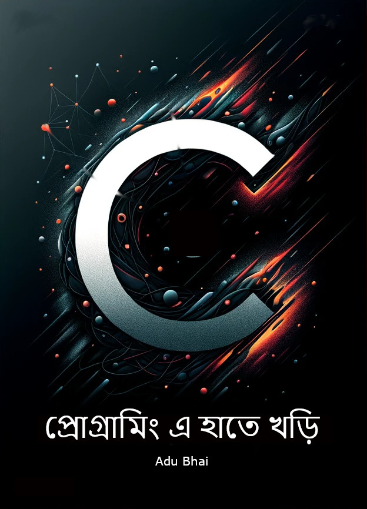

[কম্পিউটার প্রোগ্রামিং এবং কম্পিউটারের ডাটা টাইপ](datatypes.md)

[এক্সপ্রেশন, ভেরিয়েবল ও এর নামকরণ এবং রিজার্ভ ওয়ার্ড](expression.md)

[মেমোরিতে ভেরিয়েবলের অ্যাড্রেস, printf ফাংশন, প্রথম প্রোগ্রাম](firstprogram.md)

[ইনপুট, অ্যারে এবং বুলিয়ান এক্সপ্রেশন](iobool.md)

[if স্টেটমেন্ট](if-stmt.md)

[while লুপ](while_loop.md)

[for লুপ](for_loop.md)

[ফাংশন](function.md)

[স্ট্রাকচার](struct.md)

[ফাইল ইনপুট আউটপুট](fileio.md)

[স্ট্রিং অপারেশন](strings.md)

[মেমোরি অপারেশন এবং পয়েন্টার](pointer.md)

[সি ল্যাংগুয়েজের জন্য টুরিং কমপ্লিট প্রশ্নমালা ১](exercise1.md)

